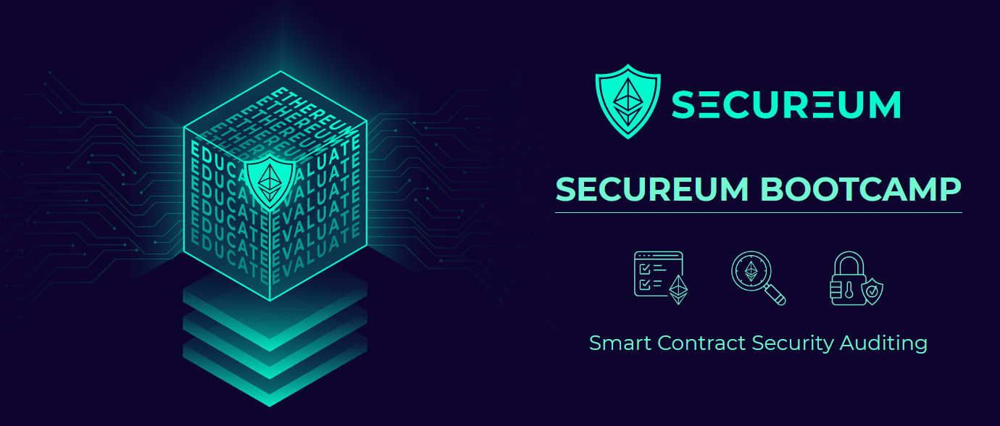

# 🛡 Secureum Bootcamp

## Mission

Secureum's mission is scaling security on the Ethereum ecosystem by acting on Ethereum's "_Layer zero_": the community, by providing education on smart contract security and best practices.

### Why?

Let's think about the ethereum ecosystem: there are billions of dollars of value, circulating on thousands of protocols, which are audited by hundreds of experts. So there’s clearly a bottleneck in security: **there are insufficient experts to properly cover all the protocols in the ecosystem**.

This fact is reflected in the losses due to security issues in many DeFi projects.

Currently, Secureum hosts the Epoch ∞ Bootcamp, which is an **ongoing bootcamp** where participants study Secureum's "`LEARN`" content at their own pace, and when ready, once a month they can sign up for a Secureum "`RACE`" to test their learnings.

Top scoring participants are invited to "`CARE`"s, to work side by side with one of Secureum’s collaborators.

It is completely free and online. For more details, `join the Secureum Discord server` or navigate to [🙌 Participate](secureum\_bootcamp/secureum\_bootcamp/participate.md).

#### Pages

**🙌 Participate**


[participate.md](secureum\_bootcamp/participate.md)


**📜 History**


[history.md](secureum\_bootcamp/history.md)


**📚 LEARN**


[1\_Ethereum\_Basics.md](learn/1.Ethereum\_Basics/1\_Ethereum\_Basics.md)



[2\_Solidity.md](learn/2.Solidity/2\_Solidity.md)



[3\_Security\_Pitfalls\_and\_Best\_Practices.md](learn/3.Security\_Pitfalls\_and\_Best\_Practices/3\_Security\_Pitfalls\_and\_Best\_Practices.md)



[4\_Audit\_Techniques\_and\_Tools.md](learn/4.Audit\_Techniques\_and\_Tools/4\_Audit\_Techniques\_and\_Tools.md)



[5\_Audit\_Findings.md](learn/5.Audit\_Findings/5\_Audit\_Findings.md)


**🌱 CARE**


[CARE](care/README.md)


**🚩 CTFs**


[A-MAZE-X CTFs](ctfs/README.md)

