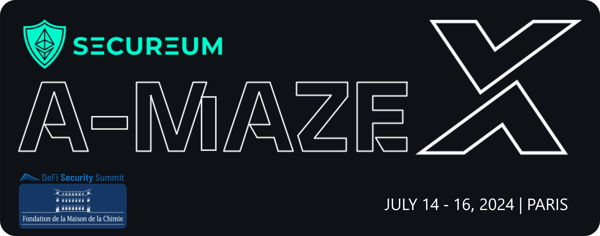

# Secureum A-MAZE-X Maison de la Chimie Paris

## **Secureum A-MAZE-X Maison de la Chimie, DeFi Security Summit**

### **A Smart Contract Security **_**Capture the Flag**_** Workshop**



_Hosted by_ [_Defi Security Summit_](https://defisecuritysummit.org) _as part of_ [_**Defi Security 101**_](https://defisecuritysummit.org/defi-101-2023/)

_Built with love by_ [_eugenioclrc_](https://github.com/eugenioclrc)_,_ [_luksgrin_](https://github.com/luksgrin)_,_ [_PeterisPrieditis_](https://github.com/PeterisPrieditis)_,_ [_RomiRand_](https://github.com/RomiRand) _and_ [_misirov_](https://twitter.com/p\_misirov)\
_Special thanks to_ [_patrickd_](https://github.com/patrickd-)_,_ [_StErMi_](https://github.com/StErMi)_,_ [_tinchoabbate_](https://github.com/tinchoabbate) _and_ [_Rajeev_](https://twitter.com/0xrajeev) _for reviewing, commenting and helping during the elaboration and design of this CTF Workshop_

***

\


## Contents

1. [**Instructions** 🕹️](a-maze-x-paris.md#instructions-️)
   * [**Flavors**](a-maze-x-paris.md#flavors)
   * [**How to play** ♘](a-maze-x-paris.md#how-to-play-)
2. [**Challenges** 🎮](a-maze-x-paris.md#challenges-)
3. [**CTF Writeup** 🗒️🗒️🗒️](a-maze-x-paris.md#ctf-writeup-️️️)

## **Instructions** 🕹️

This Workshop consists in a series of challenges, of increasing difficulty, targeting different **concepts** and common **vulnerabilities** found in **DeFi**. The CTF consists of a series of challenges suitable for different levels of expertise.

***

\


### **Flavors**

This workshop provides different flavors. Feel free to use the one you feel more comfortable with:

* **Option 1**: Locally with `Foundry`
* **Option 2**: Online through Gitpod, using `Foundry` [](https://gitpod.io/#https://github.com/misirov/DEFI101-CTF/tree/main)

***

\


### Important note

This set of challenges aren't set for competitive purposes. Their main objective is to showcase scenarios involving DeFi, `Solidity` concepts and common vulnerabilities.

Focus on **learning** and having **fun**! 😊

\


### **How to play** ♘

This challenge is thought for users who are very familiar with `Solidity` and do not want to use additional languages. The following setup tutorial will guide you through the installation of `Foundry` and its setup.

\


#### **Clone this repository**

Run the command below to clone this repository into your local machine

```bash
git clone https://github.com/secureum/AMAZEX-DSS-PARIS.git
cd AMAZEX-DSS-PARIS
```

\


#### **Install `Foundry`** _(if you don't have `Foundry` already installed)_

Run the command below to get `foundryup` the `Foundry` toolchain installer:

```bash
curl -L https://foundry.paradigm.xyz | bash
```

Then, in a new terminal session (or after reloading your `PATH` environmental variable), run `foundryup` to get the latest `forge` and `cast` binaries:

```console
foundryup
```

And finally, install the repository's dependencies by entering it and running:

```console
forge install
```

Note that you might have to restart your terminal for the `forge` command to become available.

At this point you should be all set. If not, check [`Foundry`'s installation troubleshooting](https://github.com/foundry-rs/foundry#troubleshooting-installation).

\


#### **Solving a challenge**

Challenge contracts are located in the subdirectories of the `src/` directory. **Do not** modify them, as it may lead to unexpected behaviors within the challenges.

To solve a challenge, you must open the corresponding `test/ChallengeX.t.sol` _(where X is a number)_ and add your exploit code in the signalized areas within said file.

Then, to check if the challenge has been solved, execute the following command

```bash
forge test --match-path test/ChallengeX.t.sol
```

If the solution criteria have been reached, it shall display the following message

```bash
Running 1 test for test/ChallengeX.t.sol:ChallengeXTest
[PASS] testChallenge() (gas: XXXX)
Test result: ok. 1 passed; 0 failed; finished in XXXms
```

Alternatively, to check if all challenges have been solved, execute the following command:

```bash
bash isSolved.sh
```

which will return the test results for all challenges in order.

If one wishes to have a more detailed prompt (i.e. to see the logged messages), it is necessary to increase the verbosity with `-vvvv`, for example:

```bash
forge test --match-path test/ChallengeX.t.sol -vvvv
```

***

## **Challenges** 🎮

* [**Challenge 1: Operation magic redemption** 🪄🔮](src/1\_MagicETH/)
* [**Challenge 2: Mission Modern WETH: Rescue the Ether** 🧗🧭](src/2\_ModernWETH/)
* [**Challenge 3: LendEx pool hack** 🤺🃏](src/3\_LendingPool/)
* [**Challenge 4: Operation Rescue `POSI` Token!** 💼🔓](src/4\_RescuePosi/)
* [**Challenge 5: Balloon Vault** 🎈🎈](src/5\_balloon-vault/)
* [**Challenge 6: Safe Yield?** 🏦📈](src/6\_yieldPool/)
* [**Challenge 7: Crystal DAO** 💎💎](src/7\_crystalDAO/)
* [**Challenge 8: Liquidatoooor** 🔱🔱](src/8\_oiler/)

***

## **Slides**

Find the slides of the event's presentation [here](presentation/A-MAZE-X,%20Secureum%20at%20DeFi%20Security%20101%20Paris.pdf).

***

## **CTF Writeup** 🗒️🗒️🗒️

_**Writeups will be available after the event**_

[**SOLUTIONS**](https://www.youtube.com/watch?v=dQw4w9WgXcQ)
