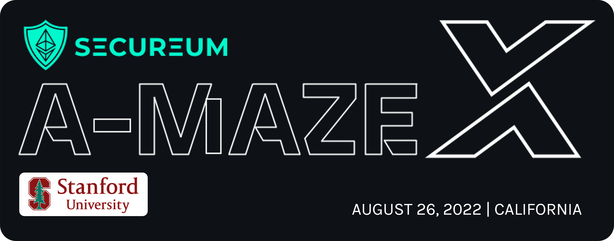

# Secureum A-MAZE-X Stanford

## **Secureum A-MAZE-X Stanford**

### **A Smart Contract Security **_**Capture the Flag**_** Workshop**

_hosted by the Stanford University as part of_ [_**Defi Security 101**_](https://defisecuritysummit.org/defi-security-101/)\
_built by_ [_eugenioclrc_](https://github.com/eugenioclrc) _and_ [_luksgrin_](https://github.com/luksgrin)\
_special thanks to_ [_patrickd_](https://github.com/patrickd-)_,_ [_StErMi_](https://github.com/StErMi)_,_ [_tinchoabbate_](https://github.com/tinchoabbate) _and_ [_Rajeev_](https://twitter.com/0xrajeev) _for reviewing, commenting and helping during the elaboration and design of this CTF Workshop_

***

## **Instructions** 🕹️

This Workshop consists in a series of challenges, of increasing difficulty, targetting different **concepts** and common **vulnerabilities** found in **DeFi**. The CTF is designed in different flavors for all kinds of users.

***

### **How to play**

This workshop provides different flavors. Feel free to use the one you feel more comfortable with:

* **Option 1**: Online through our [interactive website](https://ctf-maker-monorepo.vercel.app/)
* **Option 2**: [Online through `TenderlySandbox`](https://github.com/eugenioclrc/DeFi-Security-Summit-Stanford/tree/tenderlySandbox/)
* **Option 3**: [Locally with `Foundry`](https://github.com/eugenioclrc/DeFi-Security-Summit-Stanford/tree/foundry/)
* **Option 4**: [Locally with `Hardhat`](https://github.com/eugenioclrc/DeFi-Security-Summit-Stanford/tree/hardhat/)
* **Option 5**: Online through Gitpod, either using `Foundry` 
* **Option 6**: Online through Gitpod, using `Hardhat` 

***

### Important note

This set of challenges aren't set for competitive purposes. Their main objective is to showcase scenarios involving DeFi, `Solidity` concepts and common vulnerabilities.

Focus on **learning** and having **fun**! 😊

***

## **Challenges** 🎮

### **Challenge 0: VitaToken seems safe, right?**

Let's begin with a simple warm up. Our beloved Vitalik is the proud owner of **100 $VTLK**, which is a token that follows the ERC20 token standard. Or at least that is what it seems... 😉😉😉

📌 Upon deployment, the `VToken` contract mints **100 $VTLK** to Vitalik's address.

Is there a way for you to **steal** those tokens from him? 😈😈😈

🗒️ <em>Concepts you should be familiar with (spoilers!)</em>

* [_The ERC20 token standard_](https://ethereum.org/en/developers/docs/standards/tokens/erc-20)_, especially the meaning of approving funds._

***

**The contracts that you will hack are**:

* [**VToken**](https://github.com/eugenioclrc/DeFi-Security-Summit-Stanford/blob/master/challenges\_sources/Challenge0.VToken.sol)

***

### **Challenge 1: What a nice Lender Pool!**

Secureum has raised a lot of Ether and decided to buy a bunch of `InSecureumToken`s (**$ISEC**) in order to make them available to the community via flash loans. This is made possible by means of the `InSecureumLenderPool` contract.

📌 Upon deployment, the `InSecureumToken` contract mints an initial supply of 10 **$ISEC** to the contract deployer.

📌 The `InSecureumLenderPool` contract operates with **$ISEC**.

📌 The contract deployer transfers all of their **$ISEC** to the `InSecureumLenderPool` contract.

📌 The idea is that anyone can deposit **$ISEC**s to enlarge the pool's resources.

Will you be able to **steal** the **$ISEC**s from the `InSecureumLenderPool`? 😈😈😈

🗒️ <em>Concepts you should be familiar with (spoilers!)</em>

* _The concept of_ [_flashloans_](https://blog.chain.link/flash-loans)_. Focus on the definition, how they work and what's their original purpose._
* _Solidity's_ [_delegatecall_](https://medium.com/coinmonks/delegatecall-calling-another-contract-function-in-solidity-b579f804178c)_._

***

**The contracts that you will hack are**:

* [**InSecureumLenderPool**](https://github.com/eugenioclrc/DeFi-Security-Summit-Stanford/blob/master/challenges\_sources/Challenge1.lenderpool.sol)

**Which have interactions with the following contracts:**

* [**InSecureumToken**](https://github.com/eugenioclrc/DeFi-Security-Summit-Stanford/blob/master/challenges\_sources/tokens/tokenInsecureum.sol)

***

### **Challenge 2: it's always sunny in decentralized exchanges**

I bet you are familiar with **decentralized exchanges**: a magical place where one can exchange different tokens.\
`InsecureDexLP` is exactly that: a ~~very insecure~~ Uniswap-kind-of decentralized exchange.\
Recently, the **$ISEC** token got listed in this dex and can be traded against a _not-so-popular_ token called **$SET**.

📌 Upon deployment, the `InSecureumToken` and `SimpleERC223Token` contracts mint an initial supply of tokens 10 **$ISEC** and 10 **$SET** to the contract deployer.

📌 The `InsecureDexLP` operates with **$ISEC** and **$SET**.

📌 The dex has an initial liquidity of 9 **$ISEC** and 9 **$SET**, provided by the contract deployer. This quantity can be increased by anyone through token deposits.

📌 Adding liquidity to the dex rewards liquidity pool tokens (LP tokens), which can be redeemed in any moment for the original funds.

📌 In the `foundry` implementation, the deployer graciously airdrops the challenger (_you!_) 1 **$ISEC** and 1 **$SET**. In the `TenderlySandbox` implementation, the challenger must call the exclusive `claimAirdrop()` functions of each of the token contracts, obtaining this way 1 **$ISEC** and 1 **$SET**.

Will you be able to **drain** most of `InsecureDexLP`'s **$ISEC**/**$SET** liquidity? 😈😈😈

🗒️ <em>Concepts you should be familiar with (spoilers!)</em>

* _The concept of_ [_Automatic Market Makers (AMMs)_](https://research.paradigm.xyz/amm-price-impact)_. Focus on the constant-product formula._
* [_Other token standards_](https://www.blockchain-council.org/ethereum/ethereum-tokens-erc-20-vs-erc-223-vs-erc-777) _such as ERC223. Focus on the fallback function provided in ERC223._
* _The concept of_ [_reentrancy attack_](https://www.certik.com/resources/blog/3K7ZUAKpOr1GW75J2i0VHh-what-is-a-reentracy-attack)_._

***

**The contracts that you will hack are**:

* [**InsecureDexLP**](https://github.com/eugenioclrc/DeFi-Security-Summit-Stanford/blob/master/challenges\_sources/Challenge2.DEX.sol)

**Which have interactions with the following contracts:**

* [**InSecureumToken**](https://github.com/eugenioclrc/DeFi-Security-Summit-Stanford/blob/master/challenges\_sources/tokens/tokenInsecureum.sol)
* [**SimpleERC223Token**](https://github.com/eugenioclrc/DeFi-Security-Summit-Stanford/blob/master/challenges\_sources/tokens/tokenERC223.sol)

***

### **Challenge 3: borrow, hide and seek**

Finally, as a conclusion to this ~~not-so-secure~~ ecosystem, the Secureum team built the `BorrowSystemInsecureOracle` lending platform where one can borrow and loan **$ISEC** and `BoringToken` (**$BOR**). Both tokens can be borrowed by either providing themselves or the other token as collateral.

📌 Upon deployment, the `InSecureumToken` and `BoringToken` contracts mint an initial supply of 30000 **$ISEC** and 20000 **$BOR** to the contract deployer.

📌 `BorrowSystemInsecureOracle` uses the `InsecureDexLP` to compute the **$ISEC**/**$BOR** price.

📌 The deployer adds an initial liquidity of 100 **$ISEC** and 100 **$BOR** to the `InsecureDexLP`.

📌 Similarly, `InSecureumLenderPool` contract is funded with 10000 **$ISEC** by the deployer.

📌 The `BorrowSystemInsecureOracle` contract has an initial amount of 10000 **$ISEC** and 10000 **$BOR** provided by the deployer.

📌 Users can add collateral and take loans from `BorrowSystemInsecureOracle`.

📌 Users may also get liquidated.

Will you be able to **drain** all the **$ISEC** from `BorrowSystemInsecureOracle`? 😈😈😈

🗒️ <em>Concepts you should be familiar with (spoilers!)</em>

* [_How DeFi lending works_](https://blog.yield.app/post/defi-lending-and-borrowing-guide)_._
* _The concept of_ [_price oracle attack_](https://blog.chain.link/flash-loans)_. Notice that this concept is very related to flashloans._

***

**The contracts that you will hack are**:

* [**BorrowSystemInsecureOracle**](https://github.com/eugenioclrc/DeFi-Security-Summit-Stanford/blob/master/challenges\_sources/Challenge3.borrow\_system.sol)

**Which have interactions with the following contracts:**

* [**InSecureumLenderPool**](https://github.com/eugenioclrc/DeFi-Security-Summit-Stanford/blob/master/challenges\_sources/Challenge1.lenderpool.sol) _(this contract should be used by the attacker as part of the attack)_
* [**InsecureDexLP**](https://github.com/eugenioclrc/DeFi-Security-Summit-Stanford/blob/master/challenges\_sources/Challenge2.DEX.sol)
* [**InSecureumToken**](https://github.com/eugenioclrc/DeFi-Security-Summit-Stanford/blob/master/challenges\_sources/tokens/tokenInsecureum.sol)
* [**BoringToken**](https://github.com/eugenioclrc/DeFi-Security-Summit-Stanford/blob/master/challenges\_sources/tokens/tokenBoring.sol)

***

### CTF Writeup 🗒️🗒️🗒️

Follow [this link](https://ventral.digital/posts/2022/8/27/secureum-a-maze-x-stanford-ctf) to access this CTF's writeup by [patrickd](https://github.com/patrickd-).

Follow [this link](https://medium.com/@mattaereal/a-maze-x-ctf-walkthrough-part-0-d73338e6809) for a more detailed walk-through for each challenge by [Matías Aereal Aeón](twitter.com/mattaereal/).

Follow [this link](https://github.com/faucet0x9a54/Blockchain/tree/master/ChallengesCTF/A-maze-x) for another writeup using contracts in hardhat by [faucet0x9a54](https://twitter.com/faucet0x9a54).

***
