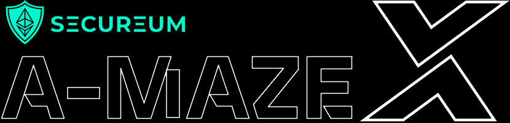

# a-MAZE-X: A Smart Contract Security Capture the Flag Workshop



Welcome to Secureum's a-MAZE-X challenge!

Within this repository you will find:
- the project's dependencies
- the smart contract codes
- tests scripts (written in `JS`)

The smart contracts to be hacked are located within the `contracts` directy.

Each challenge consists of a single `solidity` source file.

You can run each challenge using the hardhat tests;
```bash
## Challenge 1
npx hardhat run test/N1-SecureVault-easy.js

## Challenge 2
npx hardhat run test/N2-Weirdo-easy.js

## Challenge 3
npx hardhat run test/N3-TimeLock-easy.js

## Challenge 4
npx hardhat run test/N4-Padlock-medium.js

## Challenge 5
npx hardhat run test/N5-BecomeMaster-medium.js
```

Challenges are grouped in 3 different levels, and each challange awards different quantities of points to your score.

## Beginner level

I see, you are an aspiring group of security experts... Let's check if you know your A, B, Cs with these challenges ;)  

### Challenge 1: SecureVault

```
We have deployed a secure vault protected with a secret private password seed and a random generated one.
Can you guess the secret private password and drain all the locked funds?

This challenge adds 1 ether to your score. 
```

>! In case you got stuck, check out [this link](https://ethereum.stackexchange.com/questions/115601/ethers-js-equivalent-for-web3-eth-getstorageat) and [this link](https://ethereum.stackexchange.com/questions/119990/how-to-mimic-abi-encodepacked-in-ethers).

### Challenge 2: Weirdo


```
We have deployed a vault that will lock the founds forever, since it's protected with a tautology.
If only there was a way to break it... 

Anyways, it's a vault where funds are locked forever! HAHAHAH

This challenge adds 1.1 ether to your score.
```


### Challenge 3: TimeLock


```
This is yet another vault, but this time the funds are locked for a week.
But you really need those funds now... Such a shame!!!

This challenge adds 1.2 ether to your score.
```

>! In case you got stuck, check out [this link](https://forum.openzeppelin.com/t/guide-to-using-create2-sol-library-in-openzeppelin-contracts-2-5-to-deploy-a-vault-contract/2268).

## Intermediate level

If you didn't sweat with the previous 3 contracts, it's time to turn the heat up a bit!

These contracts require more patience and attention to detail. Good luck security experts!

### Challenge 4: Padlock

```
This is a padlock to be opened... If you can.
Be careful, becuse if you're too hard with it, the padlock breaks!

The password to open the first padlock is `activatexwormholemiami`,
you will have to figure out how to open the remaining ones.

This challenge adds 2 ether to your score.
```

>! In case you got stuck, check out [this link](https://www.tutorialspoint.com/solidity/solidity_conversions.htm).

>! An additional hint is: If the compiler does not allow implicit conversion but you are confident a conversion will work, an explicit type conversion is sometimes possible. This may result in unexpected behaviour and allows you to bypass some security features of the compiler e.g. `int` to `uint`. If an integer is explicitly converted to a smaller type, higher-order bits are cut off. If an integer is explicitly converted to a larger type, it is padded on the left (i.e., at the higher order end). Fixed-size bytes types while explicitly converting to a smaller type and will cut off the bytes to the right. Fixed-size bytes types while explicitly converting to a larger type and will pad bytes to the right.

### Challenge 5: BecomeMaster

```
This is a vault, where only the master can take out all the funds!
If there was only a way to become the master yourself to escape with the funds...

This challenge adds 2 ether to your score.
```

>! In case you got stuck, check out [this link](https://www.tutorialspoint.com/solidity/solidity_conversions.htm).


## Advanced

If you've gotten this far, you're are on the right track for becoming the next security superstars!

This last challenge will be absolutely different to every challenge you've faced until now.

Good luck!

### Challenge 6: Vault

```
Yet another Vault...
Some criminal you're following has locked their stolen fortune in the form of a bank's governance token.

It is your mission to infiltrate the bank's governance, take over it and steal the criminal's money.
That'll show them! Right?

This challenge adds 5 ether to your score.
```

>! In case you got stuck, check out [this link](https://hackernoon.com/hack-solidity-reentrancy-attack).
